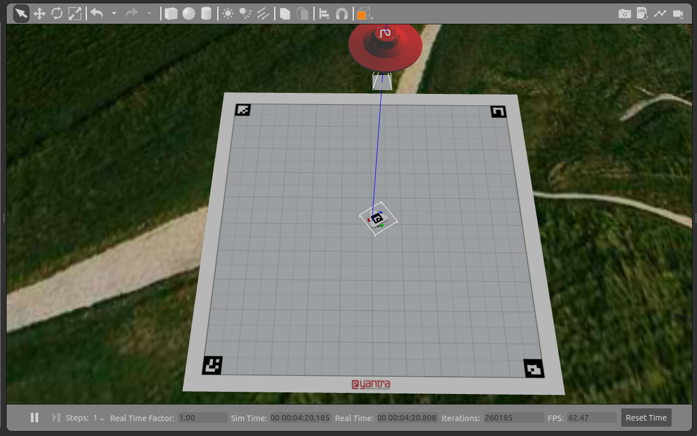
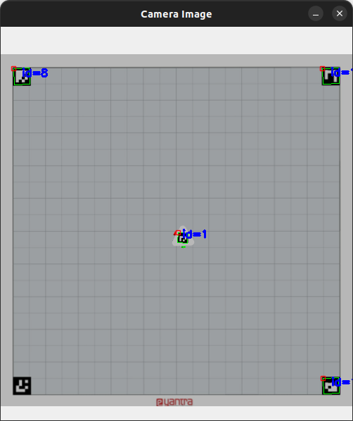
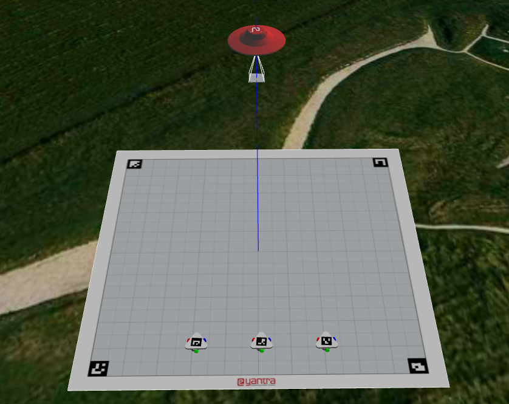

# eYantra_Task2A
Submisson for Task 2A of eYantra Robotic Competition

### Problem Statement
[EYantra Themebook Page](https://portal.e-yantra.org/themeBook/hb/Task_2/task_2a_prob_statement.html)

#### Install the dependencies
```
pip3 install opencv-contrib-python==4.7.0.72
pip3 install numpy==1.21.5
```
On getting error like pip3 not found : 
```sudo apt install python3-pip```

## Steps to run the task 2a
Clone the repository, `cd` into it and write these commands :
```
colcon build
source install/setup.bash
ros2 launch hb_task2a task2a.launch.py
```
You should see a Gazebo window looking like this :


### Run the feedback.py script
Open a second terminal and type the following: 
```
cd eYantra_Task2A
source install/setup.bash
cd src/eYRC-2023_Hologlyph_Bots/hb_task2a/scripts
python3 feedback.py
```
You should see a opencv window with aruco marker detected


### Run the service_node.py script
Open a third terminal and type the following:
```
cd eYantra_Task2A
source install/setup.bash
cd src/eYRC-2023_Hologlyph_Bots/hb_task2a/scripts
python3 feedback.py
```

### Run the controller.py script
Open a fourth terminal and type the following:
```
cd eYantra_Task2A
source install/setup.bash
cd src/eYRC-2023_Hologlyph_Bots/hb_task2a/scripts
python3 controller.py
```


## Steps to run the task 2b
Clone the repository, `cd` into it and write these commands :
```
colcon build
source install/setup.bash
ros2 launch hb_task2b task2b.launch.py
```
You should see a Gazebo window looking like this :
